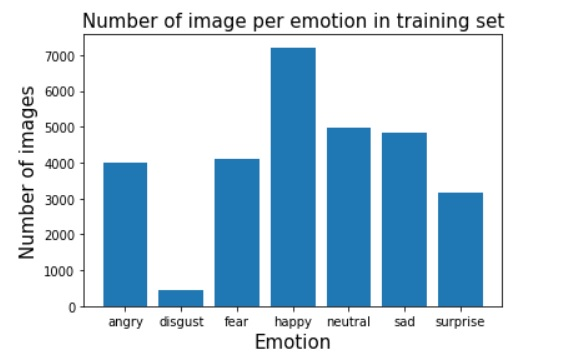
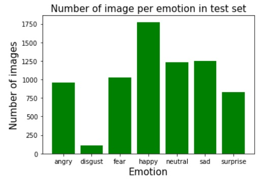
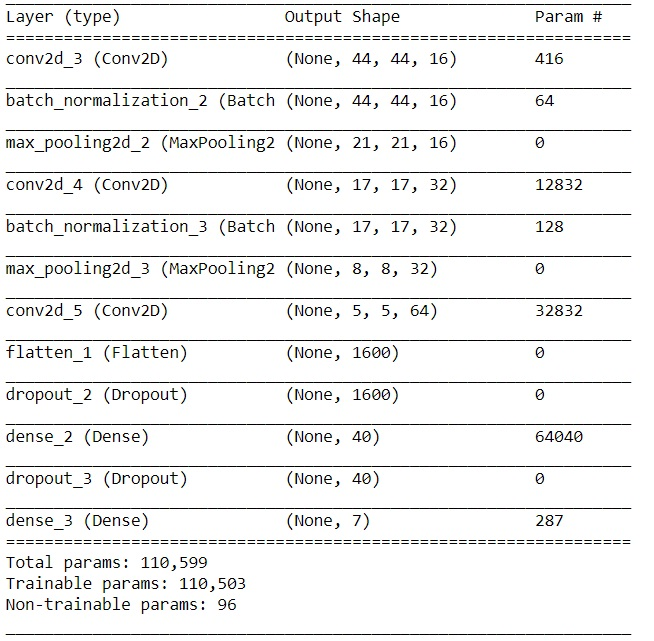
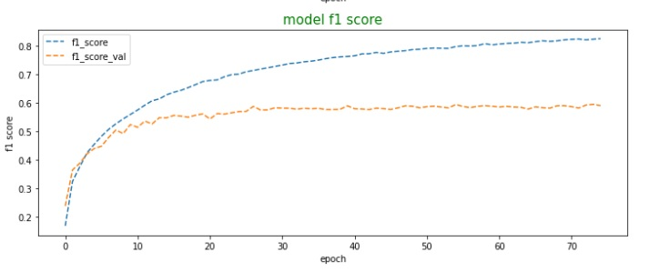
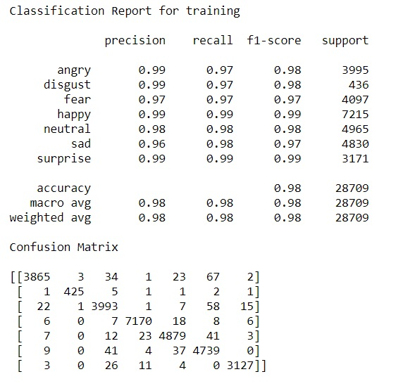
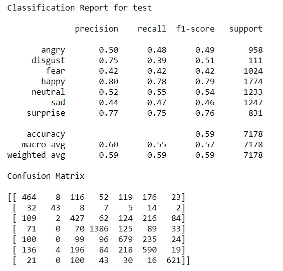

# Emotion Detection
Emotion detection using keras done on FER dataset that you can find [here](https://www.kaggle.com/chiragsoni/ferdata)
This Dataset contains 48*48 Gray sclae images of & classes which are
`angry`, `disgust`, `fear`, `happy`, `neutral`, `sad` and `surprise`.

## Model and Training
Here I have used CNN to train using keras.

### Dataset overview

- Since the dataset is unbalanced, we will use F1 score as evaluation metric.
- We will use crossentropy loss.
- Since we will be using mini-batch gradient decent, we will use adam's optimiser.

### The model used is

## Outcome

### Classification Report 

## Conclusion
As you can see, model is fitting nicely even on disgust which has such a less traning data, and we even got decent score considering traing to test data was 4:1.

